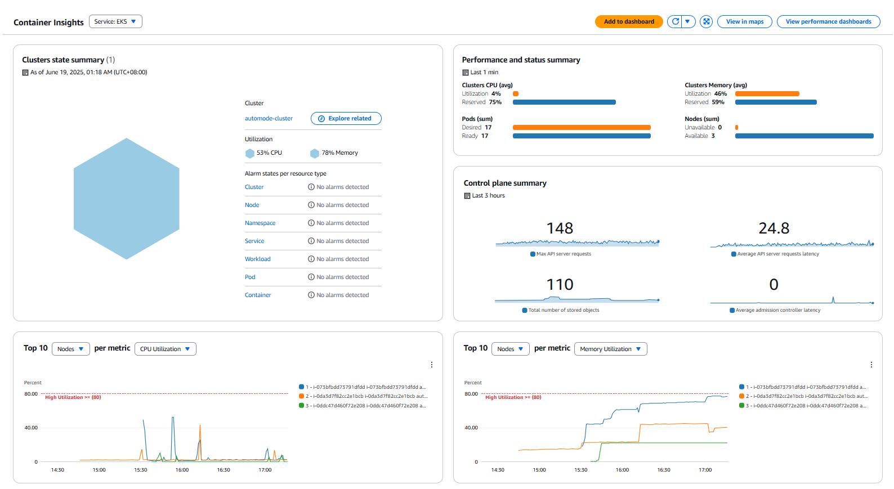
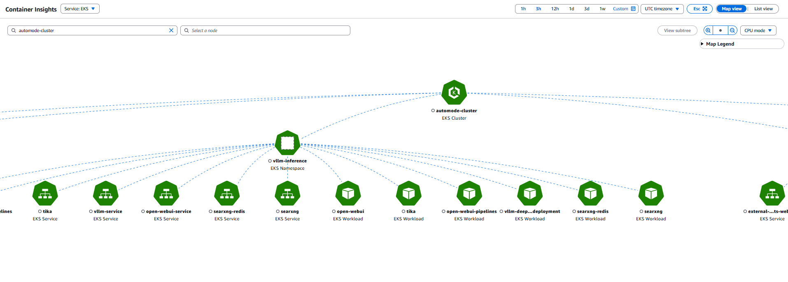
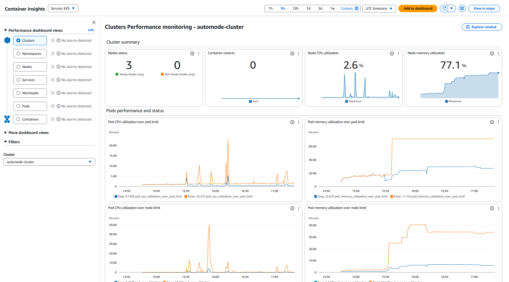
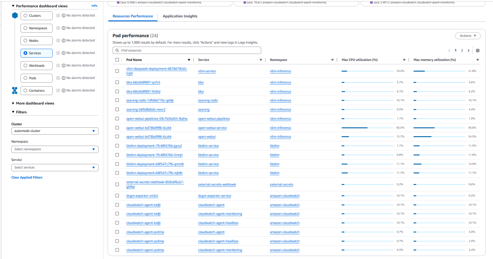

# Observability Setup

> **📊 Step 6 of 6**: This should be completed after SearXNG setup is finished.

## Overview

This directory contains the configuration and guidance for setting up comprehensive observability for your EKS Auto Mode cluster. The observability setup covers two main areas:

1. **Infrastructure Observability** - Monitor cluster health, control plane metrics, and performance
2. **Cost Observability** - Track spending, optimize costs, and understand resource utilization

## What's Already Deployed

Through the Terraform infrastructure deployment, **Container Insights has already been automatically enabled** on your EKS cluster with:

✅ **Enhanced Container Insights** - Control plane and worker node metrics collection  
✅ **CloudWatch Integration** - Metrics stored in CloudWatch for analysis  
✅ **Simplified Pod Identity** - Direct EKS add-on configuration with built-in Pod Identity  
✅ **Cost Optimization** - Container logs disabled to reduce costs while keeping all metrics  
✅ **Application Signals** - Automatic application performance monitoring enabled by default

## Infrastructure Observability

### Container Insights Console Access

Your cluster is now collecting comprehensive metrics. Here's how to access and use them:

#### 1. Navigate to Container Insights

1. **Open AWS Console** and go to **CloudWatch**
2. **In the left sidebar**, click **Insights** → **Container Insights**



Performance Dashboard:


Resource Performance:


## Cost Observability

### Uniform Tagging Strategy

Your Terraform infrastructure already implements a **consistent tagging strategy** across all AWS resources:

**Applied Tags**:
- `Blueprint: automode-cluster` - Identifies all resources belonging to this deployment
- `Environment: automode-cluster` - Environment classification
- Component-specific tags for detailed cost allocation

#### Adding Global Tags

To add additional tags that will be applied to **all resources** in your deployment:

1. **Edit the `terraform/main.tf` file**:
   ```hcl
   locals {
     # Number of AZs we wish to create
     azs = slice(data.aws_availability_zones.available.names, 0, 3)

     tags = {
       Blueprint   = var.name
       Environment = var.name
       # Add your custom tags here
       Owner       = "your-team-name"
       Project     = "ai-platform"
       CostCenter  = "engineering"
     }
   }
   ```

#### Adding Resource-Specific Tags

For **specific resources** that need additional tags beyond the global ones:

**Example - Adding tags to RDS instances**:
```hcl
# In terraform/rds.tf
resource "aws_db_instance" "postgres" {
  # ... other configuration ...
  
  tags = merge(local.tags, {
    Component = "database"
    Service   = "openwebui"
    Backup    = "daily"
  })
}
```

**Example - Adding tags to S3 buckets**:
```hcl
# In terraform/s3.tf
resource "aws_s3_bucket" "openwebui_docs" {
  # ... other configuration ...
  
  tags = merge(local.tags, {
    Component   = "storage"
    DataClass   = "documents"
    Retention   = "7-years"
  })
}
```

> **Note**: The `merge()` function combines the global tags from `local.tags` with resource-specific tags, ensuring consistent tagging across all resources.

### Using AWS Cost Explorer

With the uniform tagging in place, you can now track costs effectively:

#### 1. Access Cost Explorer
1. **Open AWS Console** → **Billing and Cost Management**
2. **Click Cost Explorer** in the left sidebar
3. **Go to Cost & Usage Reports**

#### 2. Filter by Tags
- **Group by**: Tag → Blueprint
- **Filter**: Blueprint = `automode-cluster`
- **Time Range**: Last 30 days or custom range

### Optional: KubeCost Integration

> **Free AWS Marketplace Add-on**: KubeCost standard bundle available at no additional charge

KubeCost provides detailed cost visibility at the Kubernetes workload level, complementing the AWS Cost Explorer approach with container-specific insights. The standard bundle is **free** through AWS Marketplace.

#### **What You Get (Free Standard Bundle):**
- **Pod-level Cost Attribution** - Track costs per application and namespace
- **Resource Efficiency Analysis** - Identify over-provisioned resources
- **Cost Allocation** - Chargeback and showback capabilities by namespace, deployment, service
- **Optimization Recommendations** - Right-sizing suggestions based on actual usage
- **Integration with AWS Cost Data** - Combines Kubernetes metrics with AWS billing data
- **Real-time Cost Monitoring** - Live cost tracking and alerts

#### **Deployment Steps:**

1. **Subscribe to KubeCost on AWS Marketplace**:
   - Visit [KubeCost on AWS Marketplace](https://aws.amazon.com/marketplace/pp/prodview-asiz4x22pm2n2?applicationId=AWSMPContessa&ref_=beagle&sr=0-1)
   - Click "Continue to Subscribe" (free for standard bundle)
   - Complete the subscription process

2. **Enable KubeCost in Terraform**:
   ```bash
   # Navigate to Terraform directory
   cd terraform
   
   # Enable KubeCost by setting the variable
   echo 'enable_kubecost = true' >> terraform.tfvars
   
   # Apply the changes
   terraform apply
   ```

3. **Verify Deployment**:
   ```bash
   # Check KubeCost add-on status
   aws eks describe-addon --addon-name kubecost_kubecost --cluster-name automode-cluster --region ap-southeast-3
   
   # Check KubeCost pods
   kubectl get pods --namespace kubecost
   ```

4. **Access KubeCost Dashboard**:
   ```bash
   # Port-forward to access the dashboard
   kubectl port-forward --namespace kubecost deployment/kubecost-cost-analyzer 9090
   ```
   
   Then open your browser to: `http://localhost:9090`

#### **Dashboard Features:**
- **Overview Page** - Cluster costs, cumulative spend, monthly aggregated costs
- **Cost Allocation** - Monthly EKS costs by namespace and other dimensions
- **Assets View** - AWS infrastructure costs associated with EKS resources
- **Efficiency Analysis** - Resource utilization and optimization opportunities
- **Savings Insights** - Recommendations for cost reduction

#### **Integration with Existing Cost Observability:**
- **Complements AWS Cost Explorer** - Adds Kubernetes-native cost insights
- **Uses Existing Tags** - Leverages the uniform tagging strategy already implemented
- **Enhanced Granularity** - Provides pod and container-level cost breakdown
- **Real-time Monitoring** - Live cost tracking vs. Cost Explorer's daily updates


#### **Benefits Summary:**
✅ **Free Kubernetes-native cost monitoring**  
✅ **Pod and namespace-level cost attribution**  
✅ **Real-time cost tracking and alerts**  
✅ **Resource optimization recommendations**  
✅ **Integration with existing AWS cost data**  
✅ **Managed through EKS add-ons (no manual Helm management)**  
✅ **Optional enterprise upgrade path available**  

> **Note**: KubeCost provides immediate value with the free standard bundle, giving you Kubernetes-native cost insights that complement your existing AWS Cost Explorer setup. The enterprise features are only needed for advanced use cases.

## Prerequisites

Before using the observability features, ensure you have:

1. ✅ **Completed**: Main Terraform infrastructure deployment ([see main README](../README.md))
2. ✅ **Completed**: OpenWebUI setup ([see OpenWebUI README](../setup-openwebui/))
3. ✅ **Completed**: LiteLLM setup ([see LiteLLM README](../setup-litellm/))
4. ✅ **Completed**: SearXNG setup ([see SearXNG README](../setup-searxng/))
5. ✅ **AWS Console Access** - Permissions to view CloudWatch and Cost Explorer

## Key Benefits

### Infrastructure Observability Benefits:
🔍 **Proactive Monitoring**
- Prevent ETCD database lockdowns that can freeze entire clusters
- Early detection of control plane performance issues
- Monitor application performance across all components

📊 **Performance Insights**
- Understand resource utilization patterns
- Identify bottlenecks and optimization opportunities
- Track performance trends over time

🚨 **Issue Prevention**
- Monitor critical control plane metrics
- Detect capacity issues before they impact users
- Maintain high availability for production workloads

### Cost Observability Benefits:
💰 **Cost Visibility**
- Track spending across all infrastructure components
- Understand cost drivers and optimization opportunities
- Monitor cost trends and budget adherence

🎯 **Resource Optimization**
- Identify over-provisioned or underutilized resources
- Right-size deployments based on actual usage patterns
- Optimize costs while maintaining performance

📈 **Financial Planning**
- Forecast future costs based on usage trends
- Set budgets and alerts for different components
- Enable chargeback and showback for different teams

## Completion

🎉 **Observability Setup Complete!** You now have comprehensive monitoring and cost visibility for your EKS Auto Mode AI platform.

### What You've Achieved:

✅ **Infrastructure Monitoring** - Complete visibility into cluster and application performance  
✅ **Cost Tracking** - Understand and optimize your AWS spending  
✅ **Proactive Alerting** - Foundation for preventing production issues  
✅ **Performance Insights** - Data-driven optimization opportunities  
✅ **Production Readiness** - Enterprise-grade observability stack  

Your AI platform now includes:
- **🤖 AI Chat Interface** - OpenWebUI with custom branding
- **🔄 Multi-Provider LLM** - LiteLLM gateway with cost tracking
- **🔍 Web Search** - SearXNG integration for real-time data
- **📊 Comprehensive Monitoring** - Container Insights and cost observability
- **🔒 Enterprise Security** - AWS Secrets Manager and Pod Identity
- **⚡ Auto-Scaling** - EKS Auto Mode with Karpenter

Your AI platform is now fully deployed with monitoring, cost management, and observability capabilities.
