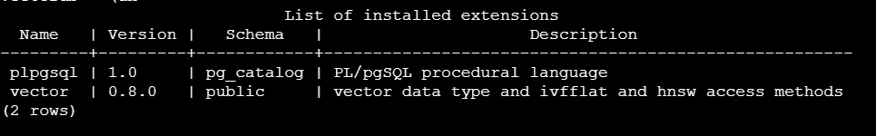
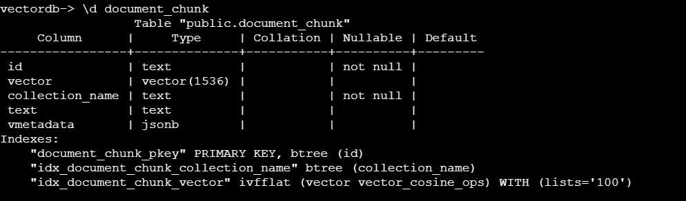

# Open WebUI Setup

> **📋 Step 2 of 3**: This should be completed after the main Terraform infrastructure deployment.

## Prerequisites

Before deploying Open WebUI, ensure you have:
1. ✅ **Completed**: Main Terraform infrastructure deployment ([see main README](../README.md))
2. An EKS Auto Mode cluster running
3. The AWS CLI configured with appropriate credentials
4. kubectl configured to access your cluster
5. **Custom GAR GPT image** available in ECR (pre-built and ready to use)

## OAuth Configuration (Optional)

This deployment supports OAuth/SSO authentication with Microsoft Azure AD and other providers.

### OAuth Setup

1. **Configure OAuth environment file**:
   ```bash
   # Copy the OAuth template (from project root)
   cp ../.env-oauth.tpl ../.env-oauth
   ```
   Edit the OAuth credentials file
   
   Add your sensitive OAuth credentials:
   ```bash
   MICROSOFT_CLIENT_SECRET=your-microsoft-client-secret-here
   OAUTH_CLIENT_SECRET=your-oauth-client-secret-here
   OPENID_PROVIDER_URL=https://your-openid-provider-url/openid-configuration
   ```

2. **Configure non-sensitive OAuth settings** in the deployment:
   
   The OAuth configuration is handled through Kubernetes ConfigMaps that are created during deployment. The default values are:
   ```yaml
   ENABLE_OAUTH_SIGNUP: "true"
   OAUTH_PROVIDER_NAME: "Sinarmas (SSO)"
   OAUTH_SCOPES: "openid email profile"
   OAUTH_CLIENT_ID: "privategpt"
   MICROSOFT_CLIENT_ID: "your-microsoft-client-id-here"
   MICROSOFT_CLIENT_TENANT_ID: "your-microsoft-tenant-id-here"
   ```

3. **Update OAuth secrets in AWS Secrets Manager**:
   ```bash
   # Run the OAuth secrets update script
   ./update-oauth-secrets.sh
   ```
   
   This script will:
   - Read your OAuth credentials from `../.env-oauth`
   - Update the AWS Secrets Manager secret
   - Sync with External Secrets Operator

   > **Note**: The Terraform deployment creates the OAuth secret in AWS Secrets Manager automatically.


## Deployment Steps

### 1. Deploy Storage Class
If in terraform folder:
```bash
cd ../setup-openwebui
```

```bash
kubectl apply -f sc.yaml
```

### 2. Apply Namespace, ClusterSecretStore, and External Secret
```bash
kubectl apply -f namespace.yaml

# Apply the ClusterSecretStore to configure AWS Secrets Manager access
kubectl apply -f cluster-secret-store.yaml

# Apply the External Secret to fetch credentials from AWS Secrets Manager
kubectl apply -f secret.yaml

# Apply the OAuth ConfigMap for non-sensitive OAuth settings
kubectl apply -f oauth-config.yaml

# Apply the OAuth ExternalSecrets for sensitive OAuth settings
kubectl apply -f oauth-secret.yaml
```

> **Note**: The ClusterSecretStore configures access to AWS Secrets Manager, and the External Secret will automatically fetch the database credentials. This approach eliminates hardcoded credentials and follows security best practices.

### 3. Create the pgvector Extension
```bash
# Apply the pgvector setup job
kubectl apply -f pgvector-job.yaml
```

Takes about a minute

```bash
# Check the job status
kubectl get jobs -n vllm-inference

# View the job logs to verify success
kubectl logs job/pgvector-setup -n vllm-inference
```

This job will:
- Connect to the PostgreSQL database from within the EKS cluster
- Create the pgvector extension if it doesn't exist
- Verify that the extension was created successfully

The logs will clearly indicate whether the operation succeeded or failed. If successful, you'll see a message like:
```
=== [date] PGVECTOR EXTENSION CREATED SUCCESSFULLY ===
=== [date] VERIFICATION SUCCESSFUL ===
=== [date] PGVECTOR SETUP COMPLETED SUCCESSFULLY ===
```

### 4. Deploy Apache Tika for Document Processing

Apache Tika provides advanced document processing capabilities, supporting over 1000 file formats including PDF, DOCX, XLSX, PPTX, and more.

```bash
# Add the Apache Tika Helm repository
helm repo add tika https://apache.jfrog.io/artifactory/tika
helm repo update

# Deploy Apache Tika
helm install tika tika/tika -f tika-values.yaml -n vllm-inference
```

Verify Tika deployment:
```bash
# Check if Tika pods are running
kubectl get pods -n vllm-inference | grep tika

# Check Tika service
kubectl get svc -n vllm-inference | grep tika
```

### 5. Deploy Open WebUI with Helm

```bash
helm repo add open-webui https://helm.openwebui.com/
helm repo update
helm upgrade --install open-webui open-webui/open-webui -f values.yaml -n vllm-inference
```

### 6. OPTIONAL - Deploy LLM

Need hugging face token for this.
```bash
kubectl create secret generic hf-secret --from-literal=hf_api_token=<hugging-face-token> -n vllm-inference
kubectl apply -f ../nodepools/gpu-nodepool.yaml
kubectl apply -f llm.yaml
```

## Configuration Details

The OpenWebUI deployment is configured to use AWS services for storage and vector embeddings:

### S3 Document Storage

OpenWebUI stores all uploaded documents in an S3 bucket that was provisioned by the Terraform deployment. This provides:

- Scalable and durable storage for documents
- Cost-effective storage with lifecycle policies
- Secure access through AWS Pod Identity

The S3 configuration is defined in `values.yaml.tpl`:
```yaml
persistence:
  enabled: true
  provider: "s3"
  s3:
    bucket: "${s3_bucket_name}"
    region: "${region}"
```

**Pod Identity for S3 Access**

Instead of using AWS access keys, this deployment uses EKS Pod Identity for secure access to S3. The Terraform deployment:

1. Creates an IAM role with permissions to access the S3 bucket
2. Associates this role with the OpenWebUI service account
3. Configures the service account in the Helm chart:
   ```yaml
   serviceAccount:
     enable: true
     name: "open-webui"
   ```

This approach eliminates the need for managing AWS credentials and follows security best practices.

### PostgreSQL Vector Database

OpenWebUI uses the RDS PostgreSQL instance with pg_vector extension for storing and querying vector embeddings:

- Document embeddings are stored as vector data types
- Similarity searches use PostgreSQL's vector operators
- The database connection is configured through a Kubernetes secret

The PostgreSQL configuration is defined in the environment variables:
```yaml
extraEnvVars:
  - name: "DATABASE_URL"
    valueFrom:
      secretKeyRef:
        name: "openwebui-db-credentials"
        key: "url"
  - name: "VECTOR_DB"
    value: "pgvector"
```

The database connection string is stored in a Kubernetes secret (`openwebui-db-credentials`) that is managed by External Secrets Operator and populated from AWS Secrets Manager.

### AWS Secrets Manager Integration

This deployment uses AWS Secrets Manager to securely store and manage database credentials:

- **No Hardcoded Credentials**: Database passwords are generated randomly and stored securely in AWS Secrets Manager
- **External Secrets Operator**: Automatically syncs credentials from AWS Secrets Manager to Kubernetes Secrets
- **Secure Access**: Uses EKS Pod Identity for secure, IAM-based access to secrets
- **Credential Rotation**: Supports future credential rotation without application changes

The External Secrets Operator creates a Kubernetes Secret from the AWS Secrets Manager secret:

```yaml
apiVersion: external-secrets.io/v1beta1
kind: ExternalSecret
metadata:
  name: postgres-external-secret
  namespace: vllm-inference
spec:
  refreshInterval: "15m"
  secretStoreRef:
    name: aws-secretsmanager
    kind: ClusterSecretStore
  target:
    name: openwebui-db-credentials
    creationPolicy: Owner
  data:
  - secretKey: url
    remoteRef:
      key: "automode-cluster-postgres-credentials"
      property: connectionString
```

This approach follows security best practices by eliminating hardcoded credentials and centralizing credential management.

### Apache Tika Document Processing

OpenWebUI is configured to use Apache Tika for advanced document processing and text extraction. Tika supports over 1000 file formats and provides superior text extraction compared to basic parsers.

**Automatic Configuration:**
The Tika server URL is automatically configured via environment variable:
```yaml
extraEnvVars:
  - name: "TIKA_SERVER_URL"
    value: "http://tika.vllm-inference.svc.cluster.local:9998"
```

**Manual Configuration (Post-Deployment):**
After deploying OpenWebUI, you need to configure it to use Tika through the admin panel:

1. **Access OpenWebUI Admin Panel**:
   - Login to your OpenWebUI instance
   - Navigate to Admin Panel → Settings

2. **Configure Document Processing**:
   - Click on the **Documents** tab
   - Change **Default content extraction engine** from "Default" to **"Tika"**
   - Verify **Context extraction engine URL** is set to: `http://tika.vllm-inference.svc.cluster.local:9998`
   - Save the changes

3. **Test Tika Integration**:
   - Upload a PDF, DOCX, or other document
   - Verify that text extraction works properly
   - Check that document content is available for chat queries

**Supported File Formats:**
- **Documents**: PDF, DOCX, DOC, RTF, TXT
- **Spreadsheets**: XLSX, XLS, CSV
- **Presentations**: PPTX, PPT
- **Images**: PNG, JPG, TIFF (with OCR)
- **Archives**: ZIP, TAR, 7Z
- **And 1000+ more formats**

## Accessing Open WebUI

After deployment, you can access Open WebUI through the Network Load Balancer:

```bash
# Apply the load balancer configuration
kubectl apply -f lb.yaml
```

Will take a while for the Load Balancer to be provisioned. Can get the URL below:

```bash
# Get the load balancer URL
export LB_URL=$(kubectl get service open-webui-service -n vllm-inference -o jsonpath='{.status.loadBalancer.ingress[0].hostname}')

# Display the URL
echo "Open WebUI is available at: http://$LB_URL"
```

The load balancer may take a few minutes to provision and become available. Once ready, you can access Open WebUI by opening the URL in your browser.

## Verification Steps

After deploying OpenWebUI, follow these steps to verify that the S3 and PostgreSQL integrations are working correctly:

### Verify S3 Document Storage

1. **Upload a document in OpenWebUI**:
   - Access the OpenWebUI interface
   - Navigate to the document upload section
   - Upload a PDF or text document

2. **Verify the document is stored in S3**:
   ```bash
   # Get the S3 bucket name
   cd ../terraform
   S3_BUCKET=$(terraform output -raw openwebui_s3_bucket)
   
   # List objects in the bucket
   aws s3 ls s3://$S3_BUCKET/
   
   # You should see your uploaded document or a folder structure containing it
   ```

### Verify PostgreSQL Vector Embeddings

1. **Generate embeddings in OpenWebUI**:
   - After uploading a document, ensure it's processed for embeddings
   - This typically happens automatically when you upload a document

2. Setup an EC2 Instance and SSH in:
```bash
RDS_ENDPOINT=<Endpoint-from-terraform-output>
sudo dnf install postgresql15
psql -h $(echo $RDS_ENDPOINT | cut -d':' -f1) -p $(echo $RDS_ENDPOINT | cut -d':' -f2) -U postgres -d vectordb
\dx
\d document_chunk
```





### Verify Apache Tika Integration

1. **Check Tika Service Status**:
   ```bash
   # Verify Tika pods are running
   kubectl get pods -n vllm-inference | grep tika
   
   # Check Tika service endpoint
   kubectl get svc tika -n vllm-inference
   ```

2. **Test Tika Server Response**:
   ```bash
   # Port forward to test Tika locally
   kubectl port-forward svc/tika 9998:9998 -n vllm-inference &
   
   # Test Tika server (should return "This is Tika Server. Please PUT")
   curl -X GET http://localhost:9998/tika
   
   # Stop port forwarding
   pkill -f "kubectl port-forward"
   ```

3. **Test Document Processing in OpenWebUI**:
   - Upload a PDF or DOCX file in OpenWebUI
   - Verify the document content is extracted and searchable
   - Check that you can ask questions about the document content

If all verifications are successful, your OpenWebUI deployment is correctly using S3 for document storage, PostgreSQL for vector embeddings, and Apache Tika for advanced document processing.

## Next Steps

🔄 **Continue to Step 3**: Once OpenWebUI is successfully deployed and verified, proceed to set up LiteLLM as a multi-provider gateway.

**👉 Next: [Setup LiteLLM](../setup-litellm/)**

LiteLLM will provide:
- Multi-provider LLM routing (local vLLM + external APIs)
- Cost tracking and usage monitoring
- Centralized API key management
- Redis caching for improved performance
